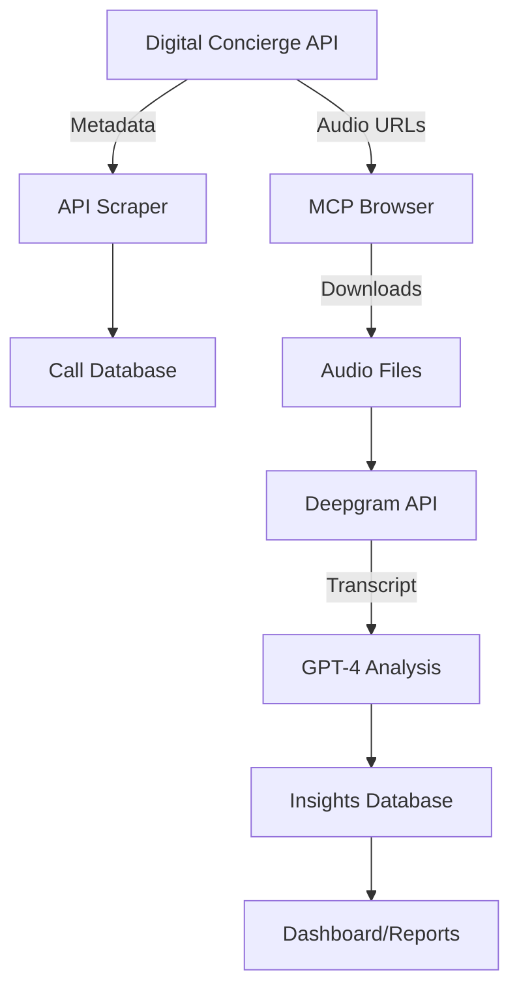

# MCP Call Analyzer Documentation

<div align="center">
  <h1>🎯 MCP Call Analyzer</h1>
  <p><strong>Automated call analysis system for automotive service centers</strong></p>
  
  [](https://www.python.org)
  [](https://deepgram.com)
  [](https://openai.com)
  [](https://supabase.com)
</div>

## 📚 Table of Contents

1. [Overview](#overview)
2. [Quick Start](#quick-start)
3. [Architecture](#architecture)
4. [Installation](#installation)
5. [Configuration](#configuration)
6. [Usage Guide](#usage-guide)
7. [API Reference](#api-reference)
8. [Development](#development)
9. [Troubleshooting](#troubleshooting)
10. [Contributing](#contributing)

## 🎯 Overview

The MCP Call Analyzer is an advanced system that automatically processes automotive service calls to extract valuable insights. It combines multiple AI technologies to transcribe, analyze, and categorize customer interactions.

### Key Features

- 🎙️ **Automatic Transcription** - Uses Deepgram's Nova-2 model with speaker diarization
- 🤖 **AI Analysis** - GPT-4 powered insights for sentiment, intent, and opportunities
- 📊 **Real-time Processing** - Batch processing with progress tracking
- 🔒 **Secure Storage** - All data stored in Supabase with proper encryption
- 🌐 **Hybrid Architecture** - API for metadata, browser automation for audio

### Use Cases

- **Service Advisors** - Review call summaries and follow-up actions
- **Management** - Track sentiment trends and missed opportunities
- **Quality Assurance** - Monitor service quality and training needs
- **Business Intelligence** - Analyze call patterns and customer needs

## 🚀 Quick Start

```bash
# Clone the repository
git clone https://github.com/yourusername/mcp-call-analyzer.git
cd mcp-call-analyzer

# Install dependencies
pip install -r requirements.txt

# Set up environment variables
cp .env.example .env
# Edit .env with your credentials

# Run initial setup
python scripts/setup_storage.py

# Process calls
python src/pipelines/final_hybrid_pipeline.py
```

## 🏗️ Architecture

### System Overview



### Component Details

#### 1. **Data Collection Layer**
- **API Scraper** (`src/scrapers/scraper_api.py`)
  - Authenticates with DC API using x-access-token
  - Fetches call metadata in batches
  - Filters calls with recordings

- **MCP Browser** (`src/scrapers/mcp_browser_scraper.py`)
  - Navigates authenticated dashboard
  - Clicks call rows to access recordings
  - Captures signed CloudFront URLs

#### 2. **Processing Layer**
- **Audio Transcription** (`src/pipelines/final_hybrid_pipeline.py`)
  - Deepgram Nova-2 with diarization
  - Speaker identification
  - High accuracy transcription

- **AI Analysis** 
  - GPT-4 for comprehensive analysis
  - Extracts: intent, sentiment, category, actions
  - Identifies missed opportunities

#### 3. **Storage Layer**
- **Supabase Tables**
  - `calls` - Call metadata and status
  - `recordings` - Audio file references
  - `transcriptions` - Full transcripts
  - `call_analysis` - AI insights

### Data Flow

1. **Discovery** → API fetches available calls
2. **Storage** → Metadata saved to database
3. **Download** → Browser accesses audio files
4. **Transcription** → Deepgram processes audio
5. **Analysis** → GPT-4 extracts insights
6. **Results** → All data stored in Supabase

## 📋 Installation

### Prerequisites

- Python 3.9 or higher
- PostgreSQL (via Supabase)
- Chrome/Chromium (for browser automation)

### Step-by-Step Installation

1. **Clone Repository**
   ```bash
   git clone https://github.com/yourusername/mcp-call-analyzer.git
   cd mcp-call-analyzer
   ```

2. **Create Virtual Environment**
   ```bash
   python -m venv venv
   source venv/bin/activate  # On Windows: venv\Scripts\activate
   ```

3. **Install Dependencies**
   ```bash
   pip install -r requirements.txt
   ```

4. **Set Up Database**
   - Create a Supabase project at https://supabase.com
   - Run the SQL schema from `docs/database/schema.sql`

5. **Configure Environment**
   ```bash
   cp .env.example .env
   ```
   
   Edit `.env` with your credentials:
   ```env
   # Digital Concierge
   DASHBOARD_USERNAME=your_username
   DASHBOARD_PASSWORD=your_password
   
   # AI Services
   OPENAI_API_KEY=sk-...
   DEEPGRAM_API_KEY=...
   
   # Database
   SUPABASE_URL=https://xxx.supabase.co
   SUPABASE_KEY=eyJ...
   ```

6. **Verify Installation**
   ```bash
   python -m pytest tests/
   ```

## ⚙️ Configuration

### Environment Variables

| Variable | Description | Required | Example |
|----------|-------------|----------|---------|
| `DASHBOARD_USERNAME` | DC dashboard username | Yes | `dev` |
| `DASHBOARD_PASSWORD` | DC dashboard password | Yes | `password123` |
| `OPENAI_API_KEY` | OpenAI API key | Yes | `sk-...` |
| `DEEPGRAM_API_KEY` | Deepgram API key | Yes | `abc123...` |
| `SUPABASE_URL` | Supabase project URL | Yes | `https://xxx.supabase.co` |
| `SUPABASE_KEY` | Supabase anon key | Yes | `eyJ...` |

### Configuration Files

#### `config/settings.json`
```json
{
  "processing": {
    "batch_size": 5,
    "days_back": 30,
    "min_duration_seconds": 30,
    "max_duration_seconds": 600
  },
  "analysis": {
    "gpt_model": "gpt-4-turbo-preview",
    "temperature": 0.3,
    "max_tokens": 500
  },
  "transcription": {
    "model": "nova-2",
    "language": "en-US",
    "diarize": true
  }
}
```

## 📖 Usage Guide

### Basic Usage

#### 1. Process Recent Calls
```python
from src.pipelines.final_hybrid_pipeline import FinalHybridPipeline

pipeline = FinalHybridPipeline()
await pipeline.run_pipeline(batch_size=10, days_back=7)
```

#### 2. Process Specific Call
```python
call_data = {
    'call_id': 'CAxxxxx',
    'dc_call_id': '68780a43d84270fd7280e818',
    'customer_name': 'John Doe',
    'duration_seconds': 180
}

result = await pipeline.process_call_complete(call_data)
```

#### 3. Batch Processing
```python
from src.pipelines.batch_processor import BatchProcessor

processor = BatchProcessor()
await processor.process_pending_calls(
    batch_size=20,
    parallel_downloads=3
)
```

### Advanced Usage

#### Custom Analysis Prompts
```python
custom_prompt = """
Analyze this call focusing on:
1. Technical issues mentioned
2. Part numbers or specific services
3. Urgency level
4. Estimated repair cost
"""

analysis = await pipeline.analyze_call(
    transcript, 
    call_info, 
    custom_prompt=custom_prompt
)
```

#### Filtering Calls
```python
# Process only long calls
calls = await pipeline.fetch_calls_batch(
    min_duration=120,  # 2 minutes
    max_duration=1800, # 30 minutes
    tags=['service', 'appointment']
)
```

## 📡 API Reference

### Core Classes

#### `FinalHybridPipeline`
Main pipeline orchestrator combining all components.

```python
class FinalHybridPipeline:
    async def authenticate(self) -> str
    async def fetch_calls_batch(self, limit: int, days_back: int) -> List[Dict]
    async def download_call_audio_mcp(self, call_data: Dict) -> Optional[str]
    async def transcribe_audio(self, audio_path: str) -> Dict
    async def analyze_call(self, transcript: str, call_info: Dict) -> Dict
    async def process_call_complete(self, call_data: Dict) -> Dict
    async def run_pipeline(self, batch_size: int, days_back: int)
```

#### `MCPBrowserScraper`
Browser automation for audio downloads.

```python
class MCPBrowserScraper:
    async def login_to_dashboard(self)
    async def navigate_to_call(self, call_sid: str, dc_call_id: str)
    async def download_audio_for_call(self, call_data: Dict) -> Optional[str]
    async def process_pending_calls(self, batch_size: int)
```

### API Endpoints Used

#### Digital Concierge API
- `POST /auth/authenticate` - Get JWT token
- `POST /call/list` - Fetch call records
- `POST /call/secureLink` - Get signed audio URLs

### Database Schema

#### `calls` Table
```sql
CREATE TABLE calls (
    call_id VARCHAR PRIMARY KEY,
    dc_call_id VARCHAR UNIQUE,
    customer_name VARCHAR,
    customer_number VARCHAR,
    call_direction VARCHAR,
    duration_seconds INTEGER,
    date_created TIMESTAMP,
    has_recording BOOLEAN,
    status VARCHAR,
    dc_transcript TEXT,
    dc_sentiment NUMERIC,
    extension VARCHAR,
    created_at TIMESTAMP DEFAULT NOW()
);
```

## 🛠️ Development

### Project Structure
```
mcp-call-analyzer/
├── src/
│   ├── scrapers/       # Data collection modules
│   ├── pipelines/      # Processing pipelines
│   ├── utils/          # Helper utilities
│   └── downloaders/    # Audio download handlers
├── tests/              # Test suite
├── scripts/            # Utility scripts
├── docs/               # Documentation
├── config/             # Configuration files
└── data/               # Local data storage
```

### Running Tests
```bash
# Run all tests
pytest

# Run specific test
pytest tests/test_transcription.py

# Run with coverage
pytest --cov=src tests/
```

### Code Style
```bash
# Format code
black src/ tests/

# Lint
flake8 src/ tests/

# Type checking
mypy src/
```

## 🔧 Troubleshooting

### Common Issues

#### 1. Authentication Failures
```
Error: Authentication failed: 401
```
**Solution**: Check DC credentials in `.env` file

#### 2. CloudFront Access Denied
```
Error: 403 Forbidden - Missing Key-Pair-Id
```
**Solution**: Use browser automation instead of direct download

#### 3. Transcription Errors
```
Error: Deepgram error: Invalid API key
```
**Solution**: Verify Deepgram API key is valid

#### 4. Database Connection Issues
```
Error: Could not find column in schema cache
```
**Solution**: Run migrations or check table schema

### Debug Mode
```bash
# Enable debug logging
export LOG_LEVEL=DEBUG
python src/pipelines/final_hybrid_pipeline.py
```

## 🤝 Contributing

We welcome contributions! Please see our [Contributing Guide](CONTRIBUTING.md) for details.

### Development Workflow
1. Fork the repository
2. Create feature branch (`git checkout -b feature/AmazingFeature`)
3. Commit changes (`git commit -m 'Add AmazingFeature'`)
4. Push to branch (`git push origin feature/AmazingFeature`)
5. Open Pull Request

### Code of Conduct
Please read our [Code of Conduct](CODE_OF_CONDUCT.md) before contributing.

---

<div align="center">
  <p>Built with ❤️ by the MCP Call Analyzer Team</p>
  <p>
    <a href="#top">Back to Top ↑</a>
  </p>
</div>