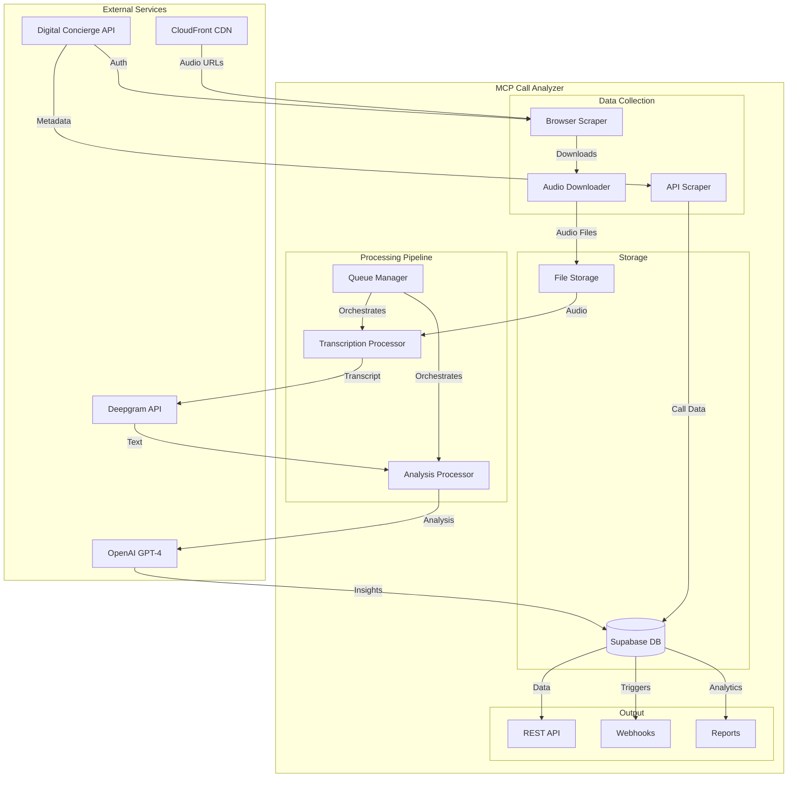
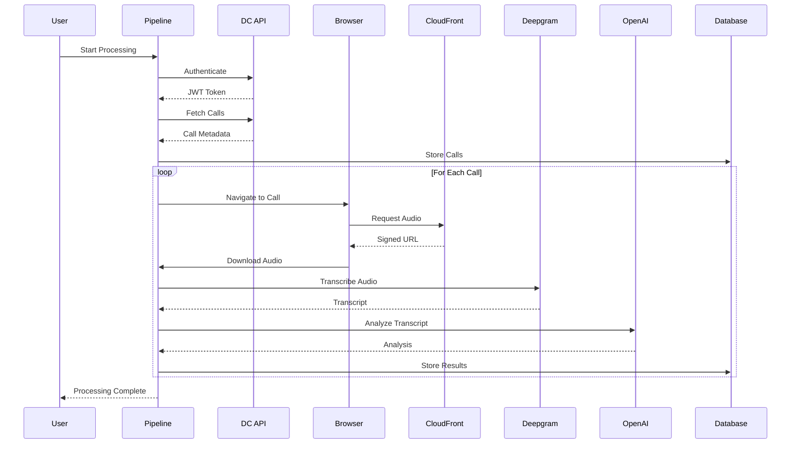
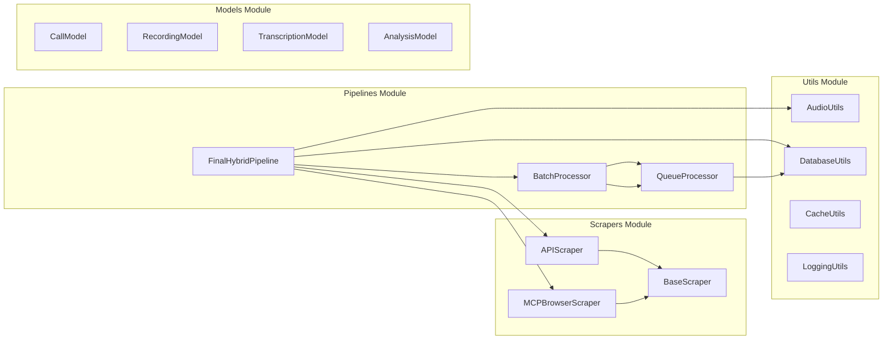
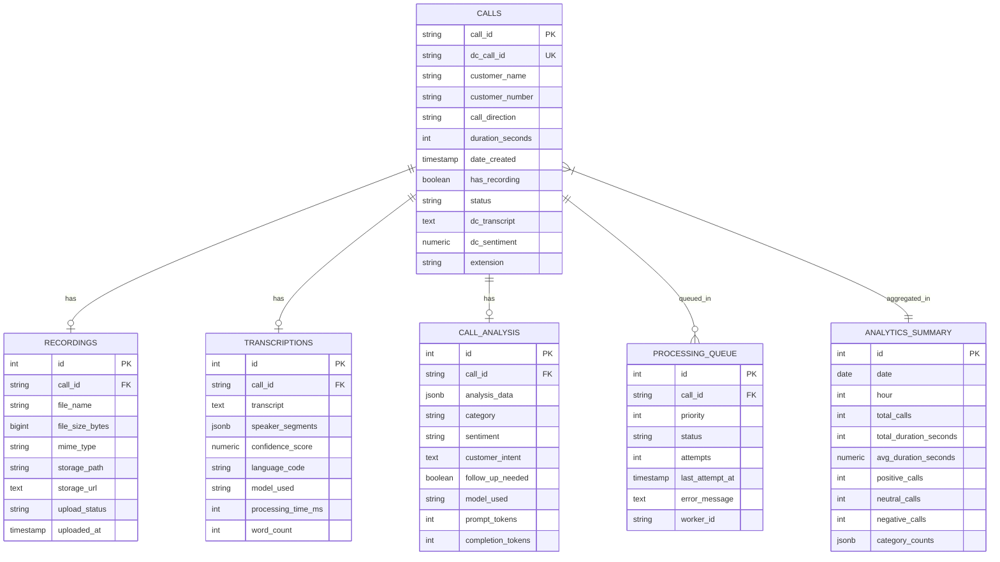
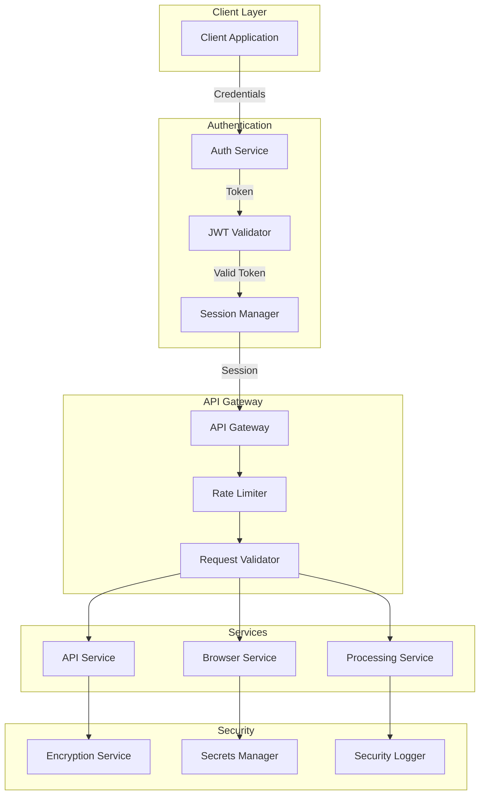
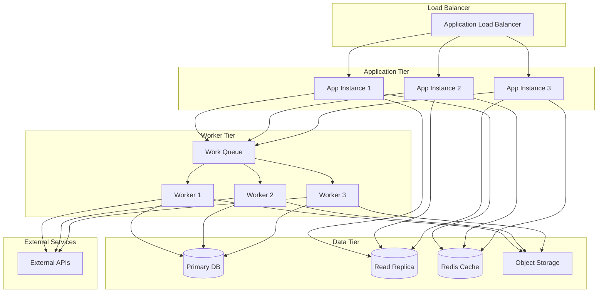
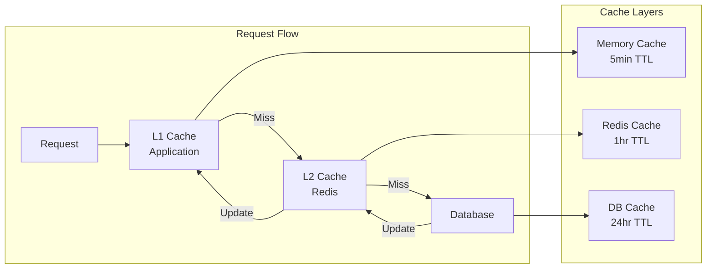
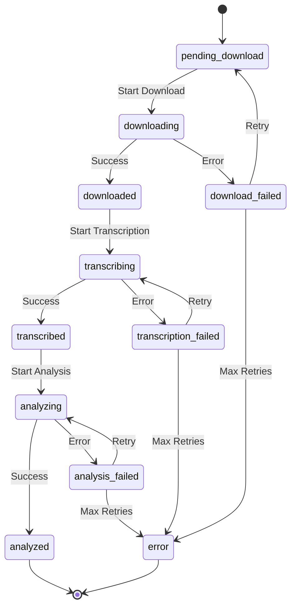
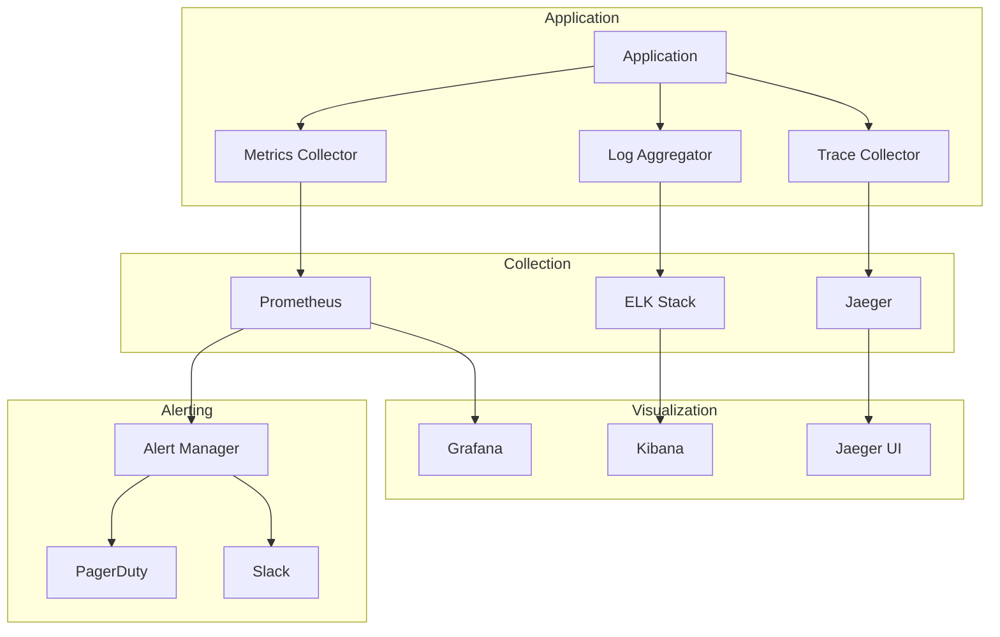
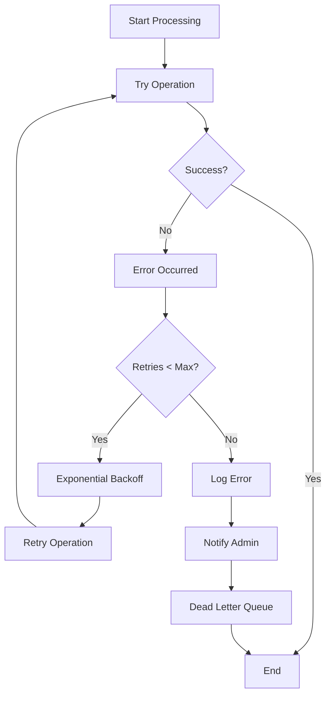

# Architecture Diagrams - MCP Call Analyzer

This document contains detailed architecture diagrams showing the system design, data flow, and component interactions of the MCP Call Analyzer.

## 📊 System Overview

### High-Level Architecture



## 🔄 Data Flow Diagram

### Complete Processing Flow



## 🏗️ Component Architecture

### Modular Design



## 💾 Database Schema

### Entity Relationship Diagram



## 🔐 Security Architecture

### Authentication & Authorization Flow



## 🚀 Deployment Architecture

### Production Infrastructure



## 📈 Performance Architecture

### Caching Strategy



## 🔄 State Machine

### Call Processing States



## 🌐 API Architecture

### RESTful Endpoints

```mermaid
graph TD
    subgraph "API Routes"
        AUTH[/auth]
        CALLS[/calls]
        TRANS[/transcriptions]
        ANAL[/analysis]
        STATS[/statistics]
    end
    
    subgraph "Auth Endpoints"
        LOGIN[POST /auth/login]
        LOGOUT[POST /auth/logout]
        REFRESH[POST /auth/refresh]
    end
    
    subgraph "Call Endpoints"
        LIST[GET /calls]
        GET[GET /calls/:id]
        PROC[POST /calls/:id/process]
        RETRY[POST /calls/:id/retry]
    end
    
    subgraph "Analysis Endpoints"
        GETA[GET /analysis/:call_id]
        REDO[POST /analysis/:call_id/redo]
    end
    
    AUTH --> LOGIN
    AUTH --> LOGOUT
    AUTH --> REFRESH
    CALLS --> LIST
    CALLS --> GET
    CALLS --> PROC
    CALLS --> RETRY
    ANAL --> GETA
    ANAL --> REDO
```

## 🔍 Monitoring Architecture

### Observability Stack



## 🚦 Error Handling Flow

### Retry and Recovery Strategy



---

## 📚 Additional Resources

- [System Requirements](../SYSTEM_REQUIREMENTS.md)
- [API Documentation](../api/API_REFERENCE.md)
- [Database Schema](../database/schema.sql)
- [Deployment Guide](../DEPLOYMENT_GUIDE.md)

---

*These diagrams are maintained using Mermaid syntax and can be rendered in any Markdown viewer that supports Mermaid diagrams.*