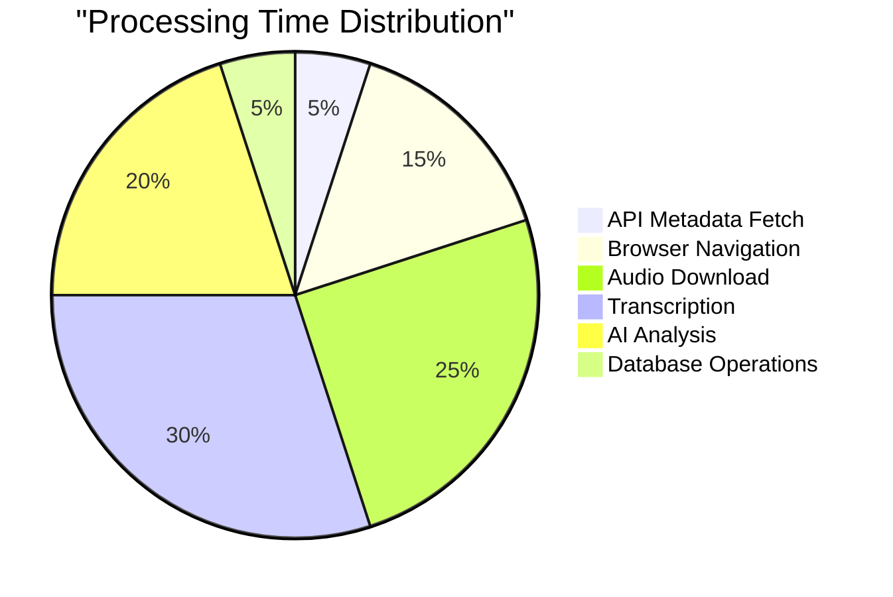

# Hybrid Pipeline Flow Diagram

## 🔄 API + Browser Automation Integration

This diagram illustrates how the MCP Call Analyzer uses a hybrid approach combining API calls for metadata and browser automation for audio access.

```mermaid
flowchart TD
    Start([Start Pipeline]) --> Auth{Authenticate}
    
    Auth -->|API| GetToken[Get JWT Token<br/>POST /auth/authenticate]
    GetToken --> FetchCalls[Fetch Call List<br/>POST /call/list]
    
    FetchCalls --> FilterCalls{Has Recording?}
    FilterCalls -->|No| NextCall[Skip Call]
    FilterCalls -->|Yes| StoreMetadata[(Store in DB<br/>calls table)]
    
    StoreMetadata --> CheckAudio{Audio Downloaded?}
    CheckAudio -->|Yes| ProcessAudio[Process Existing Audio]
    CheckAudio -->|No| BrowserStart[Start Browser Automation]
    
    BrowserStart --> Login[Login to Dashboard<br/>mcp__playwright__browser_navigate]
    Login --> NavCall[Navigate to Call URL<br/>/userPortal/calls/review?callId=xxx]
    NavCall --> ClickRow[Click Call Row<br/>mcp__playwright__browser_click]
    ClickRow --> WaitModal[Wait for Modal]
    WaitModal --> GetAudioURL[Capture Audio URL<br/>from Network Requests]
    
    GetAudioURL --> DownloadAudio[Download Audio File<br/>with Signed Parameters]
    DownloadAudio --> SaveLocal[(Save to<br/>downloads/)]
    
    SaveLocal --> ProcessAudio
    ProcessAudio --> Transcribe[Transcribe with Deepgram<br/>Nova-2 Model]
    Transcribe --> Analyze[Analyze with GPT-4]
    Analyze --> StoreResults[(Store Results<br/>transcriptions<br/>call_analysis)]
    
    StoreResults --> MoreCalls{More Calls?}
    MoreCalls -->|Yes| NextCall
    MoreCalls -->|No| Complete([Pipeline Complete])
    NextCall --> FilterCalls
    
    style GetToken fill:#e1f5fe
    style FetchCalls fill:#e1f5fe
    style Login fill:#fff3e0
    style NavCall fill:#fff3e0
    style ClickRow fill:#fff3e0
    style GetAudioURL fill:#fff3e0
    style Transcribe fill:#f3e5f5
    style Analyze fill:#f3e5f5
    
    classDef apiStyle fill:#e1f5fe,stroke:#01579b,stroke-width:2px
    classDef browserStyle fill:#fff3e0,stroke:#e65100,stroke-width:2px
    classDef aiStyle fill:#f3e5f5,stroke:#4a148c,stroke-width:2px
    classDef dbStyle fill:#e8f5e9,stroke:#1b5e20,stroke-width:2px
    
    class GetToken,FetchCalls apiStyle
    class Login,NavCall,ClickRow,GetAudioURL browserStyle
    class Transcribe,Analyze aiStyle
    class StoreMetadata,SaveLocal,StoreResults dbStyle
```

## 🔑 Key Components Explained

### API Operations (Blue)
- **Authentication**: Get JWT token from DC API
- **Fetch Calls**: Retrieve call metadata with recordings
- **Direct & Fast**: No browser overhead for metadata

### Browser Automation (Orange)
- **Dashboard Login**: Authenticate web session
- **Navigate to Call**: Load specific call review page
- **Click Interaction**: Trigger modal with audio player
- **Capture URL**: Extract signed CloudFront URL

### AI Processing (Purple)
- **Deepgram**: Speaker diarization & transcription
- **GPT-4**: Semantic analysis & insights

### Storage Operations (Green)
- **Metadata Storage**: Call information in database
- **Audio Files**: Local storage for processing
- **Results Storage**: Transcripts and analysis

## 📊 Processing Statistics

## 🚀 Optimization Strategies

1. **Parallel Processing**: Multiple browser instances for concurrent downloads
2. **Batch API Calls**: Fetch multiple calls in single request
3. **Smart Caching**: Skip already processed calls
4. **Retry Logic**: Automatic retry with exponential backoff
5. **Queue Management**: Process calls by priority

---

*This hybrid approach ensures reliable access to protected audio files while maintaining efficiency through direct API usage for metadata.*